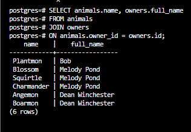
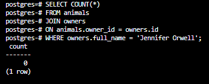
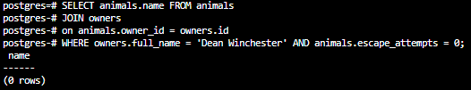
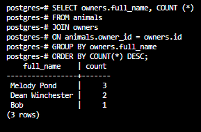

## Vet Clinic
Vet clinic is a relational database that representes a data structure for a vet clinic 

## Queries scrrenshots

1. Animals belonging to Melody Pond

2. Animals that are pokemon

3. Animal owners and their names

4. Number of animals per species

5. Digimon animals owned by Jennifer Orwell

6. Animals owned by Dean Winchester and have never tried to escape

7. Owners with most animals

## Authors

👤 **NabilHY**

- GitHub: https://github.com/NabilHY
- Twitter: https://twitter.com/NeoNabil2
- LinkedIn: https://www.linkedin.com/in/nabil-hayoun/

## 🤝 Contributing

Contributions, issues, and feature requests are welcome!

Feel free to check the [issues page](../../issues/).

## Show your support

Give a ⭐️ if you like this project!

## Acknowledgments

- Hat tip to anyone whose code was used
- Inspiration
- etc

## 📝 License

This project is [MIT](./MIT.md) licensed.
