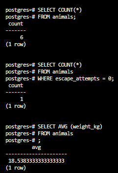
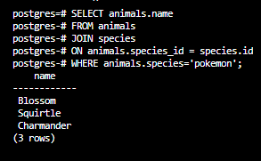
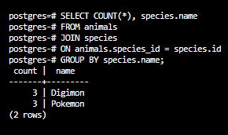

## Vet Clinic
Vet clinic is a relational database that representes a data structure for a vet clinic 

## Transactions screenshots
1. update the animals table by setting the species column to unspecified

2. Update the animals that end with mon by setting the species column to digimon & setting the species column to pokemon

3. delete all records in the animals table, then roll back the transaction

4. Delete all animals born after Jan 1st, 2022 & Update all animals' weights that are negative to be their weight multiplied by -1.

## Queries scrrenshots
1. Number of animals
2. Number of animals that have never tried to escape
3. Average weight of animals

4. Most escapes by neutered
5. Minumum and maximum weight by species

6. Average number of escape attempts per animal type of those born between 1990 and 2000

## Authors

👤 **NabilHY**

- GitHub: https://github.com/NabilHY
- Twitter: https://twitter.com/NeoNabil2
- LinkedIn: https://www.linkedin.com/in/nabil-hayoun/

## 🤝 Contributing

Contributions, issues, and feature requests are welcome!

Feel free to check the [issues page](../../issues/).

## Show your support

Give a ⭐️ if you like this project!

## Acknowledgments

- Hat tip to anyone whose code was used
- Inspiration
- etc

## 📝 License

This project is [MIT](./MIT.md) licensed.
