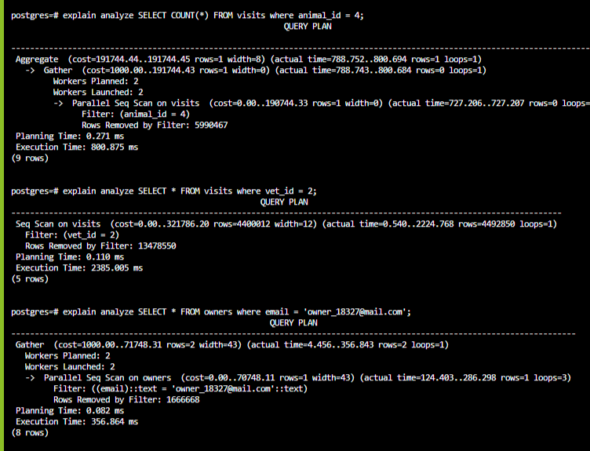
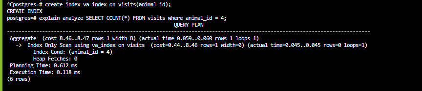
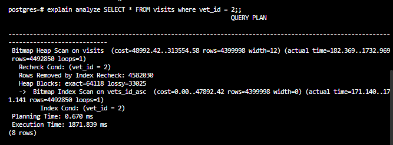
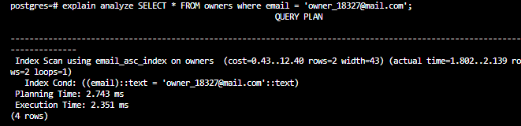

## Vet Clinic
Vet clinic is a relational database that representes a data structure for a vet clinic 


## Performance Audit

> This is a screenshot of the performance audit done on the three provided queries before adding indexes 


After having created the indexes. 
This is is how the execution time was decreased for each query 
```
1. SELECT COUNT(*) FROM visits where animal_id = 4;
```

<br>
```
2. SELECT COUNT(*) FROM visits where animal_id = 4;
```

<br>
```
3. SELECT COUNT(*) FROM visits where animal_id = 4;
```

<br>

## Authors

👤 **NabilHY**

- GitHub: https://github.com/NabilHY
- Twitter: https://twitter.com/NeoNabil2
- LinkedIn: https://www.linkedin.com/in/nabil-hayoun/


## 🤝 Contributing

Contributions, issues, and feature requests are welcome!

Feel free to check the [issues page](../../issues/).

## Show your support

Give a ⭐️ if you like this project!

## Acknowledgments

- Hat tip to anyone whose code was used
- Inspiration
- etc

## 📝 License

This project is [MIT](./MIT.md) licensed.
