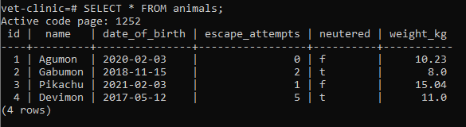
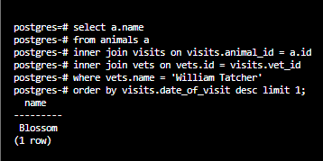
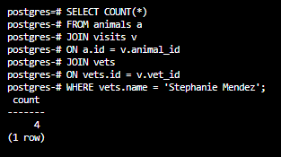
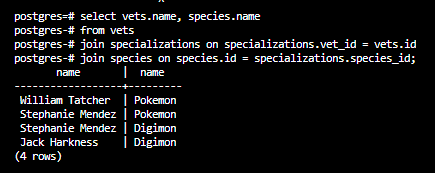
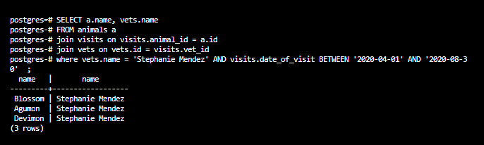
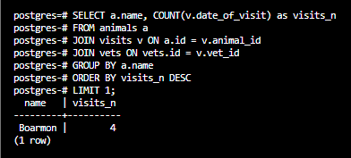
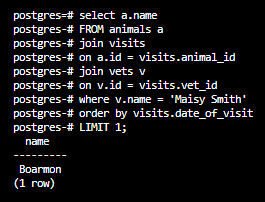
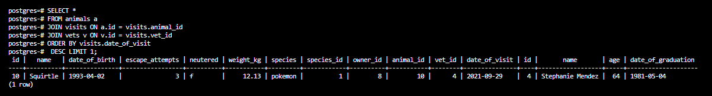
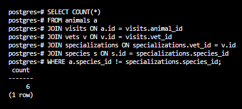
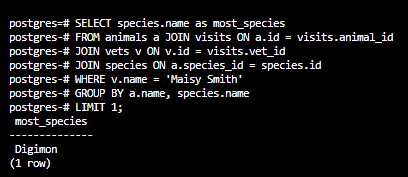

## Vet Clinic
Vet clinic is a relational database that representes a data structure for a vet clinic 

## Queries scrrenshots

1. 

2.

3.

4. 

5.

6.

7. 

8.

9.

## Authors

👤 **NabilHY**

- GitHub: https://github.com/NabilHY
- Twitter: https://twitter.com/NeoNabil2
- LinkedIn: https://www.linkedin.com/in/nabil-hayoun/

## 🤝 Contributing

Contributions, issues, and feature requests are welcome!

Feel free to check the [issues page](../../issues/).

## Show your support

Give a ⭐️ if you like this project!

## Acknowledgments

- Hat tip to anyone whose code was used
- Inspiration
- etc

## 📝 License

This project is [MIT](./MIT.md) licensed.
