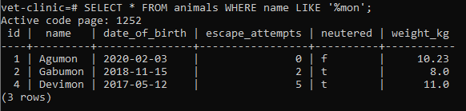
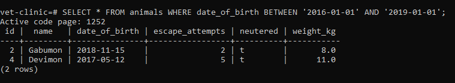
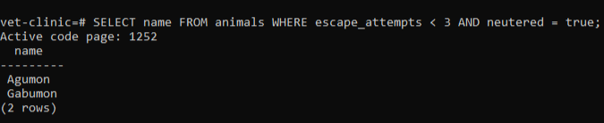
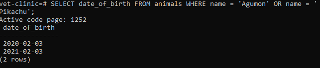
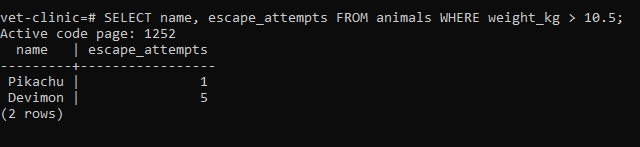
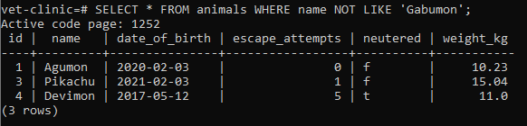
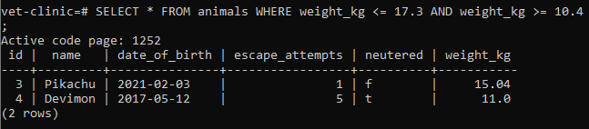

## Vet Clinic
Vet clinic is a relational database that representes a data structure for a vet clinic 

## Queries screenshots
1. animals whose name ends in mon

2. animals born between 2016 and 2019.

3. animals that are neutered and have less than 3 escape attempts

4. date of birth of all animals named either Agumon or Pikachu.

5. name and escape attempts of animals that weigh more than 10.5kg

6.animals that are neutered

7. animals not named Gabumon.

8. animals with a weight between 10.4kg and 17.3kg

## Authors

👤 **NabilHY**

- GitHub: https://github.com/NabilHY
- Twitter: https://twitter.com/NeoNabil2
- LinkedIn: https://www.linkedin.com/in/nabil-hayoun/

## 🤝 Contributing

Contributions, issues, and feature requests are welcome!

Feel free to check the [issues page](../../issues/).

## Show your support

Give a ⭐️ if you like this project!

## Acknowledgments

- Hat tip to anyone whose code was used
- Inspiration
- etc

## 📝 License

This project is [MIT](./MIT.md) licensed.
